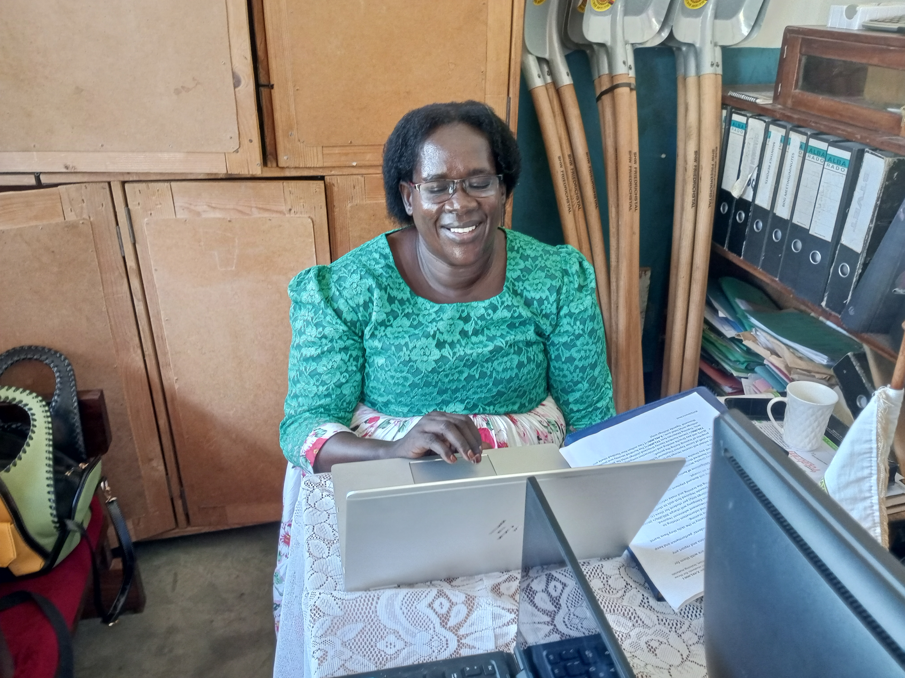
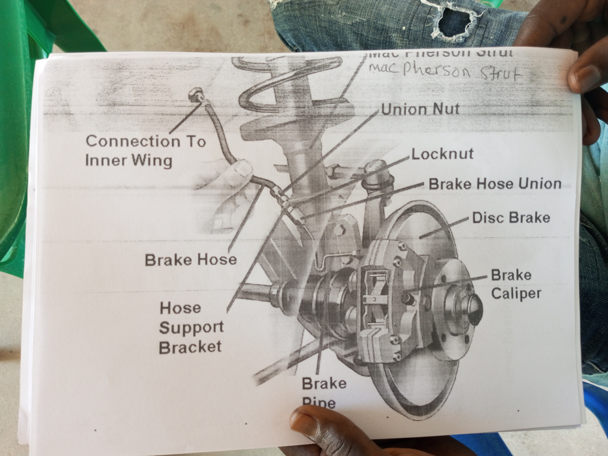
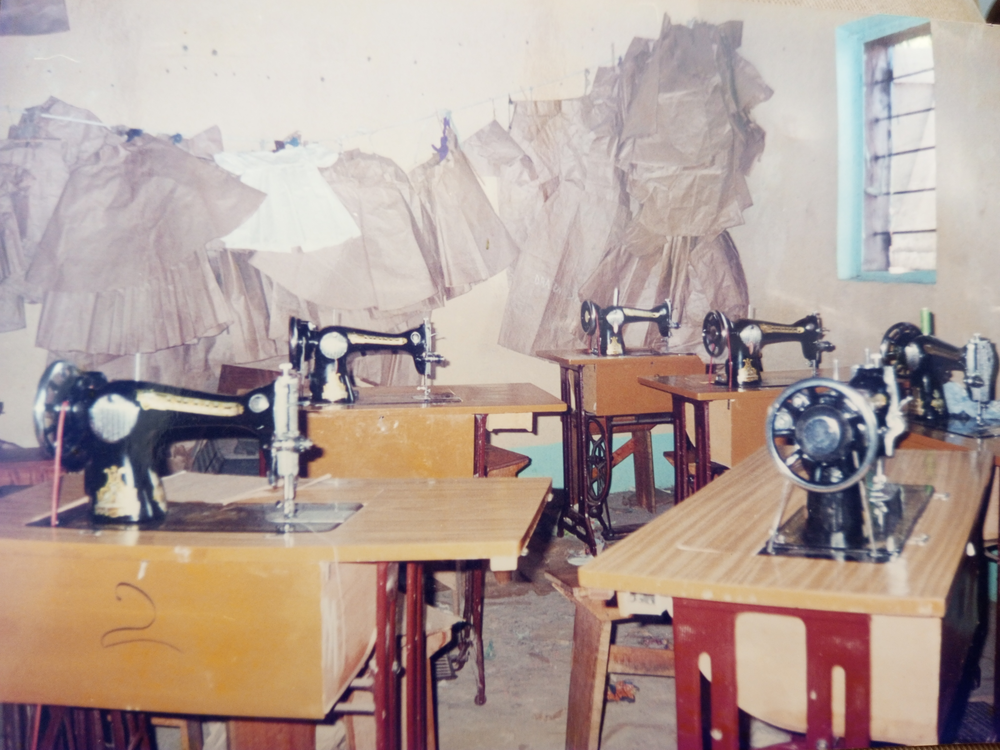
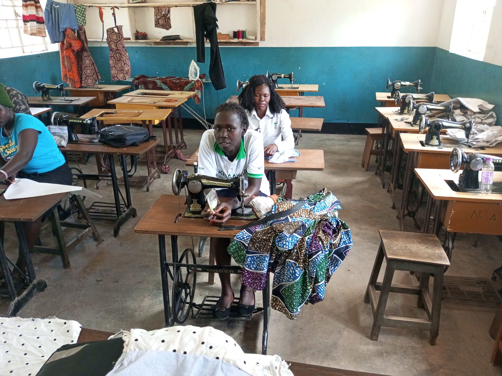

# Brief Introduction

Junior Express Vocational Training School is about 2kms away from Adjumani Town Council, it is located on the South West of Adjumani District Headquarters. It was registered in 1993 with the objective to provide training to the most vulnerable youth, people with disability, women and girls affected by war and poverty across West Nile and Northern Uganda. After the process of the registration, the School effectively started operation in 1997 and it has so far trained and graduated over 1,000 students in various trades, thus it has impacted positively in the increased household income to various vulnerable households of the host and refugee communities.

**Photo credit: wafela andrew chardso (LEAD)**

The school have administrative and technical personnel's delivering services effectively to the vulnerable communities. 

**Director:Mrs Lakonyi Janet**

**Instructor for mechanics:Mr ceaser mahad**

The school have basic tools and equipment’s in all the trades offered, the permanent and pre-permanent learning structures (building) including accommodation are available.

**Driving and mechanics**

